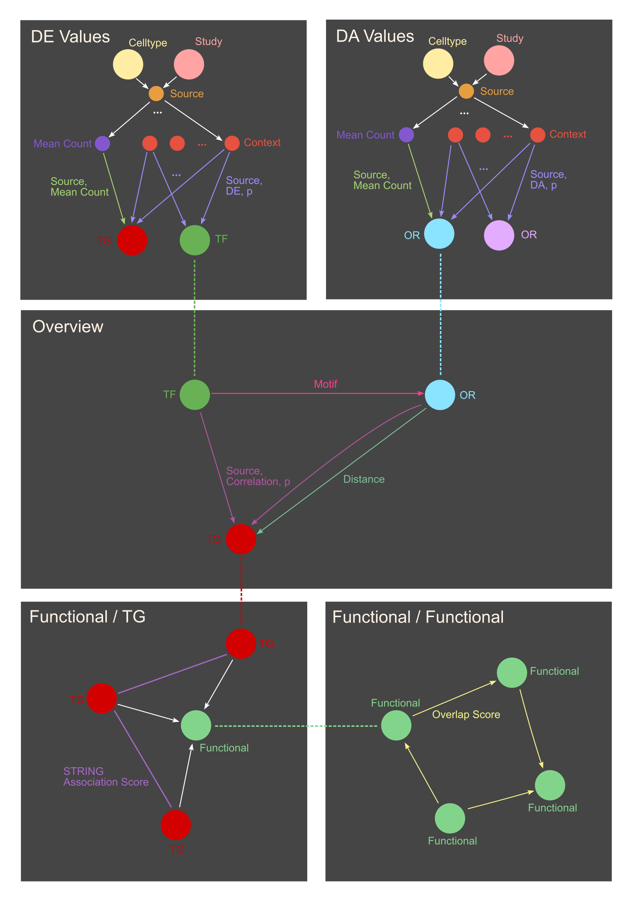
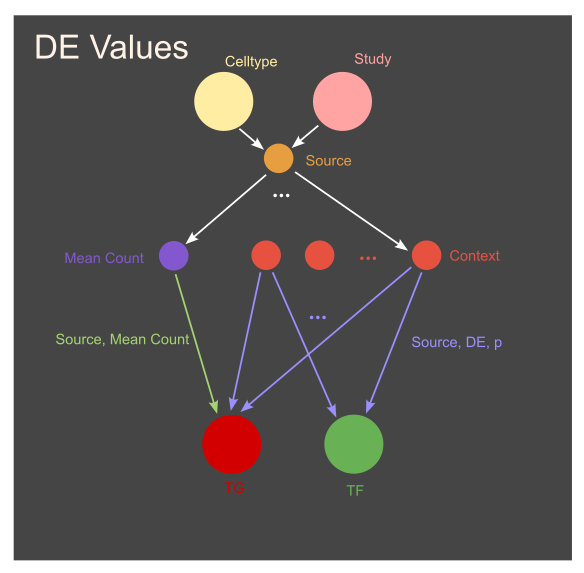
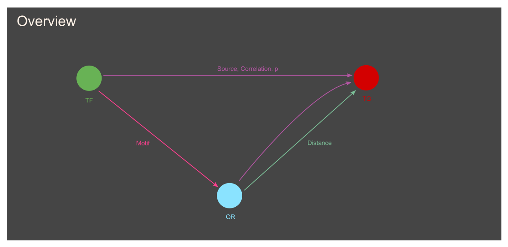
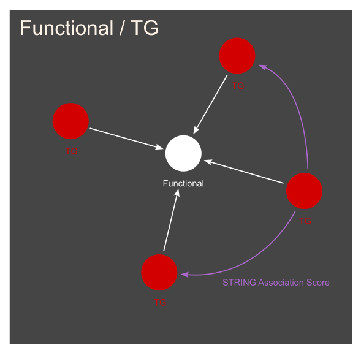
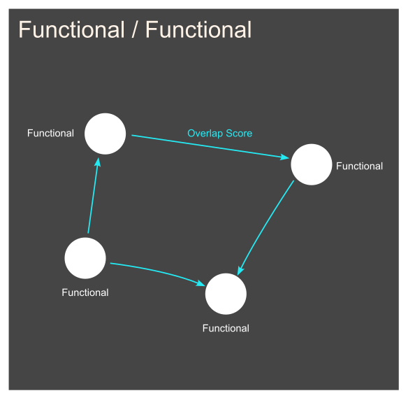

# Graph Model

## Node Types
1. Celltype
    * Properties:
        - Name (String): Celltype Name

2. Study
    * Properties:
        - Source (String): Source of the study (e.g. in-house)

3. Context
    * Properties:
        - Context (String): Specified context (e.g. 6h-0h, RC12h-12h etc.)

4. FT (Functional Term)
    * Properties:
        - Term (String): Term of entity (e.g. GO:0007275)
        - Category (String): Category of FT (e.g. Biological Process (Gene Ontology))
        - Name (String): Name of FT (e.g. Multicellular organism development)

5. MeanCount (Placeholder node)
    * Properties: None

6. OR (Open Region)
    * Properties:
        - Annotation (String):
        - Feature (String):

7. Source (Placeholder / Aggregation Node)
    * Properties: None
    
8. TF (Transcription Factor) / TG (Target Gene)
    * Properties:
        - ENSEMBL (String): The ENSEMBL ID of the Entity
        - ENTREZID (Integer): The Entez Gene ID
        - SYMBOL (String): Symbol(s) of the Gene
        - Annotation (String): Annotation / More info on the Gene
    * Note: Transcription Factors have both TF and TG labels

## Relationships

### Source-specific

1. HAS 
    * Between:
        - Celltype -> Source
        - Study -> Source
        - Source -> Context
        - Source -> MeanCount
    * Properties: None

2. MEANCOUNT
    * Between:
        - MeanCount -> TG
        - MeanCount -> OR
    * Properties:
        - Source (Integer): ID of Source node in DB
        - Value (Float): Mean count value found in experiment

3. DE
    * Between:
        - Context -> TG
    * Properties:
        - Source (Integer): ID of Source node in DB
        - Value (Float): DE Value found in experiment under specified Context
        - p (Float): p value associated with the DE value

4. DA
    * Between:
        - Context -> OR
    * Properties:
        - Source (Integer): ID of Source node in DB
        - Value (Float): DA Value found in experiment under specified Context
        - p (Float): p value associated with the DA value

5. CORRELATION
    * Between:
        - TF -> TG
        - OR -> TG
    * Properties:
        - Source (Integer): ID of Source node in DB
        - Correlation (Float): Correlation Value found in experiment between two entities

7. (DISTANCE)
    * Between:
        - OR -> TG
    * Properties:
        - Distance (Integer): Distance between OR and TG
    * Note: This information is not specific to the experiment

### Source unspecific

1. LINK
    * Between:
        - TG -> FT
    * Properties: None

2. OVERLAP
    * Between:
        - FT -> FT
    * Properties:
        - Score (Float): Overlap score as previously computed by Victor (?)

3. STRING
    * Between:
        - TG -> TG
    * Properties:
        - Score (Integer): STRING Association Score between two Genes

4. MOTIF
    * Between:
        - TF -> OR
    * Properties:
        - Motif (String): Motif of OR that TF binds to
    * Note: This information is not specific to the experiment

5. DISTANCE
    * Between:
        - OR -> TG
    * Properties:
        - Distance (Integer): Distance between OR and TG
    * Note: This information is not specific to the experiment

## Statistics

### Nodes:
| Type | old (Mouse) | new (Mouse)| new (Human) |
| --- | --- | --- | --- |
| Terms / (in new DB: FT) | 24.170 | 28.742 | 29.773 |
| Proteins | 22.048 | 66.953 | 122.614 |
| Target Genes (TG) | 0 | 22.478 | 23.899 |
| Transcription Factors (TF, are also TGs) | 0 | 2.894 | 3.529 |
| Open Regions (OR) | 0 | 1.431.123 | - |
| Context | 0 | 23  | - |
| Celltype | 0 | 16 | - |
| Subtype | 0 | 209 | - |
| MeanCount | 0 | 1 | - |
| Source | 0 | 216 | - |
| Study | 0 | 2 | - |
| Total | 46.218 | 1.549.763 | 176.286 |

#### Total Nodes in new DB: 1.726.049

### Edges:
| Type | old (Mouse) | new (Mouse) | new (Human) |
| --- | --- | --- | --- |
| ASSOCIATION / (in new DB: STRING) | 7.248.179 | 6.255.439 | 6.653.145 |
| CORRELATION (TG, TF) | 0 | 1.739.921 | 0 |
| CORRELATION (TG, OR) | 0 | 4.066.833 | 0 |
| VALUE (DA) | 0 | 533.220 | 0 |
| VALUE (DE) | 0 | 50.135  | 0 |
| DISTANCE | 0 | 1.286.065 (with Dummies) | 0 |
| KAPPA | 81.676 | 0 (to be deprecated) | 0 |
| LINK (Protein, FT) | 0 | 9.371.340 | 18.130.661 |
| LINK (Gene, FT) | 0 | 2.700.152 | 2.691.163 |
| MEANCOUNT (TG) | 0 | 10.027 | 0 |
| MEANCOUNT (OR) | 0 | 106.644 | 0 |
| MOTIF | 0 | 34.553.249 (with Dummies) | 0 |
| OVERLAP | 0 | 6.762.321 | 6.925.609 |
| PRODUCT | 0 | 66.953 | 122.614 |
| HAS | 0 | 655 | - |
| Total | 7.329.855 | 67.502.954 | 34.523.192 |

#### Total Edges in new DB: 102.026.146

## Notes

Since some ENSEMBL Gene IDs are mapped to multiple ENSEMBL Protein IDs, and duplicate associations between traget genes were removed, the resulting number of STRING edges is smaller than that of the ASSOCIATION edges in the previous database. Additionally, for 66 Proteins in STRING no equivalent ENSEMBL Gene IDs were found.
