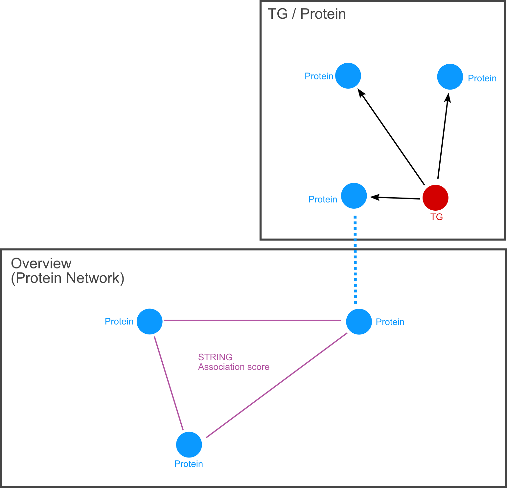
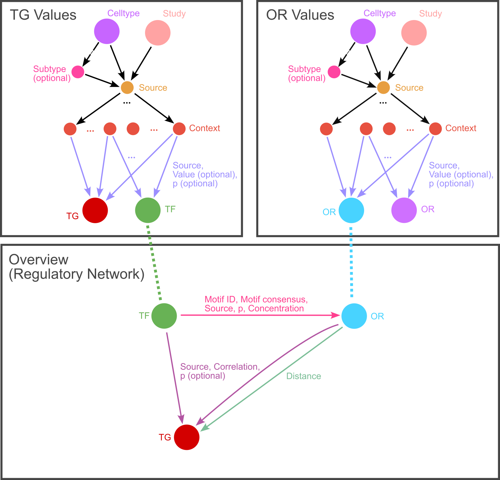
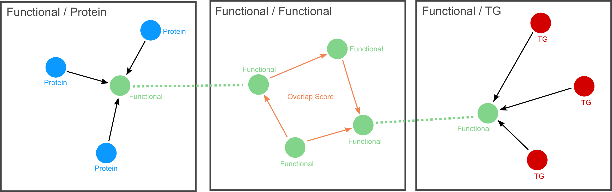

# Graph Model

[**Statistics**](#statistics)

**Networks:** 
1. [Protein Network](#protein-network)
2. [Regulatory Network]()
3. [Functional Network]()

## Protein Network

### Node Types
#### Protein
Protein Node for every Protein in ENSEMBL and STRING

###### Properties
- ENSEMBL
- SYMBOL
- annotation
- protein_size

#### TG
Gene node for every Gene in ENSEMBL
##### TF
Label indicates whether TG encodes transcription factor

###### Properties
- ENSEMBL
- SYMBOL
- ENTREZID
- annotation

### Edge Types
#### STRING
STRING Association Score between [Protein](#protein) nodes

###### Properties
- Score

#### PRODUCT
Links [TG](#tg) and [Protein](#protein) nodes, found in ENSEMBL files

## Regulatory Network

### Node Types
#### Celltype
High level Celltype (e.g. Microglia, Neuron, etc.)

###### Properties
- name

#### Subtype
Cell sub- and subsubtype (e.g. Gabaergic Neurons, Glutamatergic Neurons with specific characteristics)

###### Properties
- name

#### Source
Source node to indicate Linking between Study and Celltype

#### Study
Representation of Study in Database. Can include Meta Information.

###### Properties
- name
- source

#### Context
Represents context under which experiment data on entities was found

##### Timeframe
Label for DE / DA Values

##### Location
Label for Location based information

##### MeanCount
Label for Mean count information

###### Properties
- Context

#### TG
Gene node for every Gene in ENSEMBL
##### TF
Label indicates whether TG encodes transcription factor

###### Properties
- ENSEMBL
- SYMBOL
- ENTREZID
- annotation

#### OR
Open chromatin region nodes for ORs found in experiments

###### Properties
- id
- annotation
- feature

### Edge Types
#### HAS
Connects [Celltype](#celltype)/[Subtype](#subtype) and [Study](#study) nodes with [Source](#source) nodes, and [Source](#source) nodes with [Context](#context) nodes

#### IS
Indicates hierarchical structure of Type of Cells (Parent is always the higher level [Cell-](#celltype)/[Subtype](#subtype))

#### VALUE
Includes Experiment Values, between [Context](#context) and Entity ([OR](#or) / [TG](#tg-1))

###### Properties
- Source
- Value
- p

#### MOTIF
Transcription factor Motif information, Connects [TF](#tf-1) and [OR](#or) nodes

###### Properties
- Source
- Concentration
- Consensus
- id
- p
- Dummy

#### CORRELATION
Correlation information found in experiments, Connects [OR](#or) and [TG](#tg-1), or [TF](#tf-1) and [TG](#tg-1) nodes

###### Properties
- Source
- Correlation
- p

#### DISTANCE
Distance between [OR](#or) to nearest [TG](#tg-1)

###### Properties
- Distance
- Dummy

## Functional Network

### Node Types
#### FT
Functional Term nodes

###### Properties
- Category
- Name
- Proteins
- Term

#### TG
Gene node for every Gene in ENSEMBL
##### TF
Label indicates whether TG encodes transcription factor

###### Properties
- ENSEMBL
- SYMBOL
- ENTREZID
- annotation

#### Protein
Protein Node for every Protein in ENSEMBL and STRING

###### Properties
- ENSEMBL
- SYMBOL
- annotation
- protein_size

### Edge Types
#### OVERLAP
Connects [FT](#ft) nodes, with overlap score

###### Properties
- Score

#### LINK
Connects [FT](#ft) and [TG](#tg-2) or [Protein](#protein-1) nodes, represents association

## Statistics

### Nodes:
| Type | old (Mouse) | new (Mouse)| new (Human) |
| --- | --- | --- | --- |
| Terms / (in new DB: [FT](#ft)) | 24.170 | 28.715 | 29.794 |
| [Proteins](#protein) | 22.048 | 67.249 | 123.031 |
| Target Genes ([TG](#tg)) | 0 | 22.478 | 23.900 |
| Transcription Factors ([TF](#tf), are also TGs) | 0 | 2.894 | 3.529 |
| Open Regions ([OR](#or)) | 0 | 1.431.123 | - |
| [Context](#context) | 0 | 24  | - |
| [Celltype](#celltype) | 0 | 16 | - |
| [Subtype](#subtype) | 0 | 209 | - |
| [Source](#source) | 0 | 216 | - |
| [Study](#study) | 0 | 2 | - |
| Total | 46.218 | 1.550.032 | 176.725 |

#### Total Nodes in new DB: 1.726.757

### Edges:
| Type | old (Mouse) | new (Mouse) | new (Human) |
| --- | --- | --- | --- |
| ASSOCIATION / (in new DB: [STRING](#string)) | 7.248.179 | 6.342.177 | 6.857.702 |
| [CORRELATION](#correlation) (TG, TF) | 0 | 1.739.921 | 0 |
| [CORRELATION](#correlation) (TG, OR) | 0 | 4.066.833 | 0 |
| [VALUE](#value) (Timeframe, OR) | 0 | 533.220 | 0 |
| [VALUE](#value) (Location, OR) | 0 | 28.947.056  | 0 |
| [VALUE](#value) (MeanCount, OR) | 0 | 106.644 | 0 |
| [VALUE](#value) (Timeframe, TG) | 0 | 50.135 | 0 |
| [VALUE](#value) (MeanCount, TG) | 0 | 10.027 | 0 |
| [DISTANCE](#distance) | 0 | 1.286.065 (with Dummies) | 0 |
| KAPPA | 81.676 | 0 (to be deprecated) | 0 |
| [LINK](#link) (Protein, FT) | 0 | 7.276.727 | 14.253.772 |
| [LINK](#link) (Gene, FT) | 0 | 2.104.222 | 2.112.933 |
| [MOTIF](#motif) | 0 | 34.553.249 (with Dummies) | 0 |
| [OVERLAP](#overlap) | 0 | 4.584.738 | 4.754.455 |
| [PRODUCT](#product) | 0 | 66.953 | 122.614 |
| [HAS](#has) | 0 | 655 | - |
| [IS](#is) | 0 | 209 | - |
| Total | 7.329.855 | 91.668.831 | 28.101.476 |

#### Total Edges in new DB: 119.770.307

## Notes

